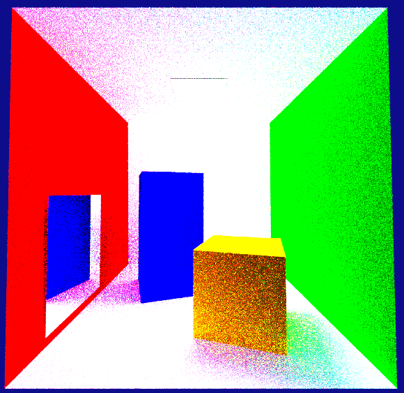

# Multiple Image Formats Implemented

É possível guardar os renders produzidos nos seguintes formatos de imagem:

JPG             |  PPM      |  PFM         | 
:-------------------------:|:-------------------------:|:-------------------------:|
          |        |   | 

OpenEXR **sem ToneMapping**                         |  OpenEXR **com ToneMapping**
:-------------------------:|:-------------------------:
     | 
