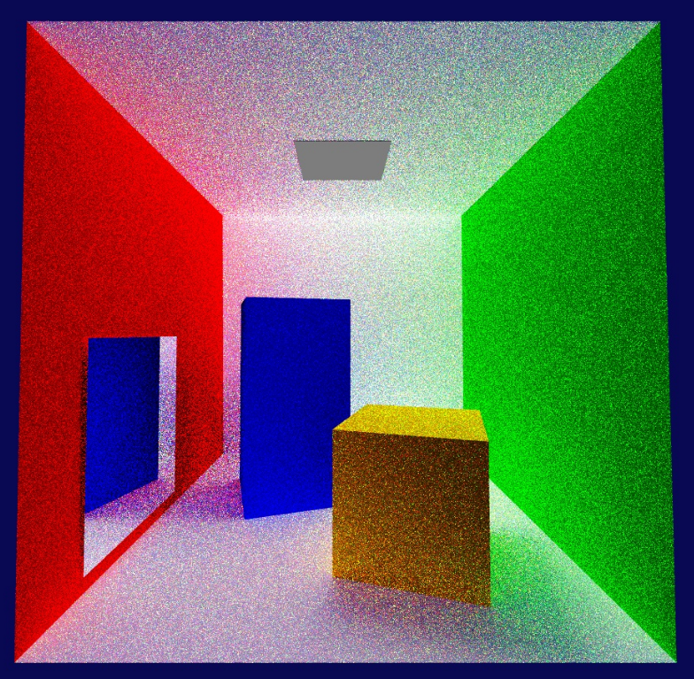
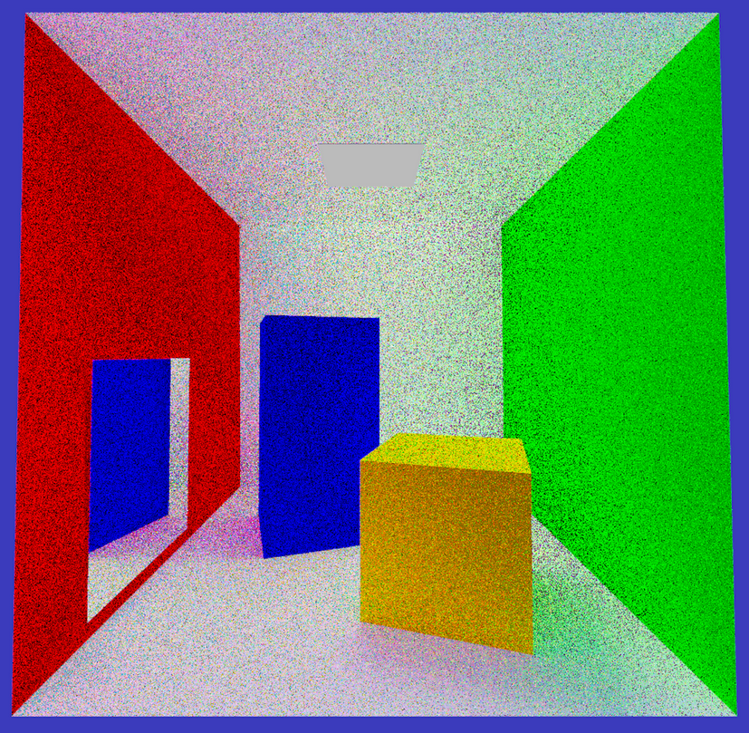
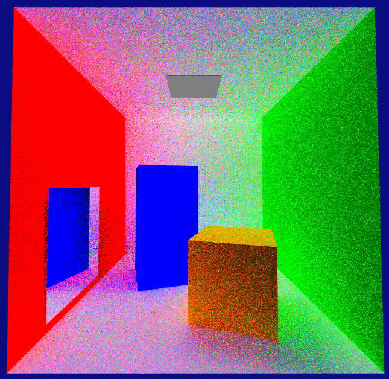

# Multiple Image Formats Implemented

É possível guardar os renders produzidos nos seguintes formatos de imagem:

JPG             |  PPM      |  PFM         | OpenEXR **sem ToneMapping**                         |  OpenEXR **com ToneMapping**
:-------------------------:|:-------------------------:|:-------------------------:|:-------------------------:|:-------------------------:
          |           |   |      | 

